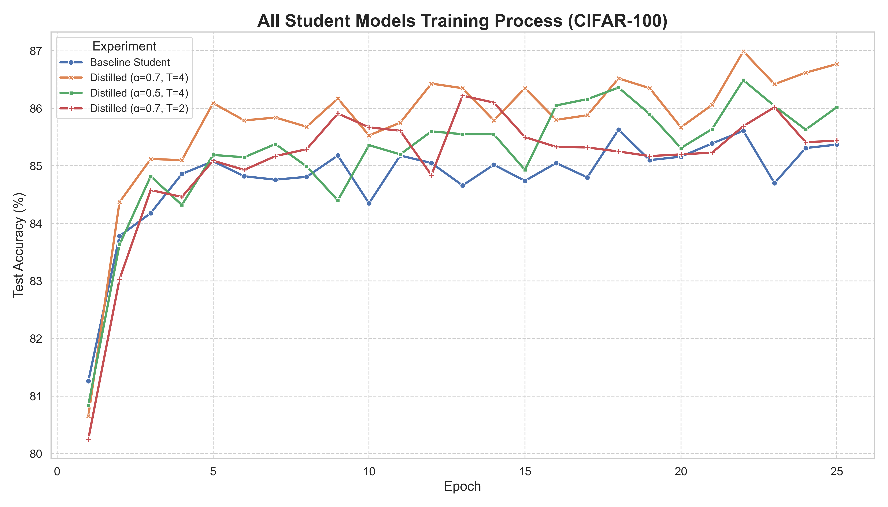

# 项目：基于知识蒸馏的视觉Transformer (ViT) 模型压缩

## 一、 项目概述 (Project Overview)

本项目旨在解决大型视觉Transformer (ViT) 模型因参数量巨大、计算密集而难以在实际场景中部署的问题。通过应用经典的知识蒸馏（Knowledge Distillation, KD）算法，将一个在目标数据集上经过精调的大型ViT-Base模型（教师）所学到的知识，迁移到一个轻量级的DeiT-Small模型（学生）上。

实验结果表明，该方法成功地在**显著压缩模型（参数量减少74%）**的同时，有效提升了轻量级模型的性能，使其超越了独立训练的基线水平，验证了知识蒸馏在ViT模型压缩上的有效性。

## 二、 技术栈与核心配置 (Tech Stack & Core Configuration)

* **模型 (Models):**
    * **教师模型 (Teacher):** `google/vit-base-patch16-224` (~86M 参数)
    * **学生模型 (Student):** `facebook/deit-small-patch16-224` (~22M 参数)
* **数据集 (Dataset):** `CIFAR-100` (100个类别, 5万张训练图片, 1万张测试图片)
* **核心算法 (Algorithm):** Hinton 经典知识蒸馏
    * **损失函数:** `L_total = α * L_soft + (1 - α) * L_hard`
* **主要框架与库 (Frameworks & Libraries):**
    * `PyTorch`
    * `Hugging Face Transformers` (模型加载)
    * `Hugging Face Datasets` (数据处理)
    * `Seaborn` & `Matplotlib` (结果可视化)

## 三、 实验流程与实现 (Experimental Workflow & Implementation)

本项目的实际执行流程经过精心设计，以确保实验的严谨性和结论的有效性，具体分为以下四个步骤：

#### 1. 教师模型微调 (Teacher Model Fine-tuning)
* **动机**: 直接从Hugging Face下载的`ViT-Base`模型是在ImageNet数据集上预训练的“通才”，并非针对CIFAR-100任务的“专家”。为了让教师能够提供高质量的指导信息，必须先对其进行微调。
* **实现**: 运行 `finetune_teacher.py` 脚本，在CIFAR-100训练集上对`ViT-Base`模型进行25个Epoch的微调。最终模型在测试集上达到了 **91.00%** 的准确率，其权重被保存为 `vit_base_cifar100_finetuned.pth`，作为后续蒸馏实验的专家教师。

#### 2. 基线实验 (Baseline Experiment)
* **动机**: 为了科学地衡量知识蒸馏的效果，必须先确定学生模型在没有教师指导的情况下，独立学习所能达到的性能上限。
* **实现**: 运行 `train.py` 脚本，并将核心超参数 `alpha` 设置为 `0`。这意味着损失函数中只有 `L_hard` 项生效，学生模型仅根据真实标签进行标准训练。

#### 3. 知识蒸馏与超参数探索 (Knowledge Distillation & Hyperparameter Tuning)
* **动机**: 利用微调好的专家教师模型，通过知识蒸馏算法提升学生模型的性能，并探索关键超参数`alpha`和`temperature`对蒸馏效果的影响。
* **实现**: 多次运行 `train.py` 脚本，加载微调后的教师模型权重，并设置不同的 `alpha` 和 `T` 组合进行实验，例如：
    * `alpha=0.7`, `T=4`
    * `alpha=0.5`, `T=4`
    * `alpha=0.7`, `T=2`

#### 4. 性能优化 (Performance Optimization)
* **问题**: 在实验初期，发现数据预处理（`.map()`操作）速度较慢，成为了效率瓶颈。
* **解决**: 经排查，是`DataLoader`中的`num_workers`（CPU工作进程数）参数设置较低。通过将其增加到 `10`（后优化为`20`），充分利用了服务器的多核CPU资源，显著加速了数据加载和预处理流程。

## 四、 实验结果与分析 (Results & Analysis)

#### 1. 最终性能对比

**核心性能指标汇总表：**
| 模型配置 (Model Configuration) | 参数量 (Params) | 最终准确率 (Test Acc %) |
| :--- | :--- | :--- |
| **Teacher (ViT-Base)** | **~86M** | **91.00%** |
| **Baseline (ViT-Small)** | **~22M** | **85.37%** |
| Distilled (α=0.7, T=4) | ~22M | **86.77%** |
| Distilled (α=0.5, T=4) | ~22M | 86.02% |
| Distilled (α=0.7, T=2) | ~22M | 85.44% |

#### 2. 训练过程对比

#### 3. 结论分析
1.  **知识蒸馏效果显著**: 最佳配置（α=0.7, T=4）下的蒸馏学生模型准确率达到 **86.77%**，相较于 **85.37%** 的基线模型，取得了 **1.4%** 的显著性能提升。
2.  **实现高效压缩**: 学生模型以仅教师模型 **~25%** 的参数量，达到了其 **95.3%** 的性能（86.77% / 91.00%）。
3.  **超参数影响显著**: 对比不同实验可发现，`T=4` 时的效果普遍优于 `T=2`，说明对于此任务，更“软”的知识有助于学生学习。`alpha=0.7` 的表现优于 `0.5`，表明在此设置下，学生从教师处获得的收益大于从真实标签获得的收益。

## 五、 项目总结 (Project Summary)

本项目成功地端到端实现了一个针对Vision Transformer的知识蒸馏压缩流程。通过严谨的对比实验和超参数探索，不仅验证了经典知识蒸馏算法的有效性，也深入理解了其核心参数的作用。整个过程涉及了数据处理、模型微调、算法实现、性能优化和结果分析等多个环节，构成了一个完整的小型机器学习研究项目。